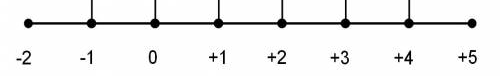
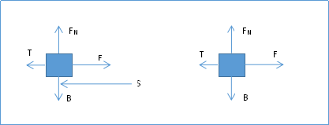

# Προαγωγικές Εξετάσεις Ιουνίου - Φυσική Β Γυμνασίου

#### Άσκηση 1
Ένας άνθρωπος μετατοπίζεται απο την Θέση Α στην Θέση Β και εν συνεχεία στην Θέση Γ, όπως δείχνεται στο παρακάτω σχήμα

Α. Να υπολογιστούν οι μετατοπίσεις

A. ΔΧα->β  
B. ΔΧβ->γ    
Γ. ΔΧα->γ

Β. Ποια ειναι η συνολικη αποσταση που διενυσε

#### Άσκηση 2
Ενας ανθρωπος διανυει μια αποσταση S=350 Km σε 5Η.
Α. Να βρεθεί η μέση του ταχύτητα Um.  
Β. Εάν διένυε την απόσταση S=350 Km με μέση ταχύτητα Um=25Km/h σε πόσο χρόνο θα την κάλυπτε.

#### Άσκηση 3
Α. Ποια μεγεθη ονομάζουμαι διανυσματικά και ποιά μονόμετρα   
Β. Αναφέρατε τρία διανυσματικά μεγέθη και τρία μονόμετρα με τις μονάδες και τα σύμβολα τους  

#### Άσκηση 4
Απαντήστε στις παρακάτω ερωτήσεις
Α. Τι ονομάζουμαι τροχιά  
Β. Τι ειναι η στιγμιαία ταχύτητα  
Γ. Δύο σώματα κινούνται πάνω σε ένα ευθύγραμμο δρόμο. Το πρώτο σώμα έχει ταχύτητα υ1=36 km/h , ενώ το δεύτερο υ2= 11 m/s. Ποιο από τα δύο σώματα έχει μεγαλύτερη ταχύτητα ;

#### Άσκηση 5

Α) Σχηματίστε τις δυνάμεις που ασκούνται σε ένα αυτοκίνητο που κινείται.

Β) Βρείτε την συνισταμένη των δυνάμεων που ασκούνται στο παρακάτω σώμα. (μέτρο και διεύθυνσή)

#### Άσκηση 6
Α) Γιατί στην σελήνη οι αστροναύτες μπορούν να κάνουν μεγαλύτερά άλματα.
Β) Τι είναι η βαρύτητά.
Γ) Κατατάξτε από την μεγαλύτερη τιμή προς την μικρότερη το βάρος ενός ανθρώπου πού 	βρίσκεται στην ελλαδα παραθαλάσσια, στον Όλυμπο, στον βόρειο πόλο, στην γαλλια

#### Άσκηση 7
A) Να δοθεί ο ορισμός της πίεσης, τύπος και μονάδες.

B) Ένας ελέφαντας έχει 4 πόδια εμβαδού Α =0.1m2  και μάζα m=300kgr. Δίνεται η επιτάχυνσή της βαρύτητάς  g=10m/s2. . Να βρεθεί η πίεση που ασκεί στο έδαφος.

#### Άσκηση 8
Α) Τι είναι η υδροστατική πίεση, τύπος και μονάδες.

Β)Ένας άνθρωπος βρίσκεται στο βυθό της θαλασσής και δέχεται υδροστατική πίεσή Pυδρ=100000 Pascal (Ν/m2). Ποιο το βάθος που βρίσκεται ο άνθρωπος. Δίνεται επίσης η πυκνότητά της θάλασσας ρ=1100kgr/m3 και η επιτάχυνση της βαρύτητας g=10m/s2.

#### Άσκηση 9
A) Δώστε τον τύπο του έργου και την μονάδα μέτρησης.
B) Ένα σώμα δέχεται τις δυνάμεις που δείχνονται στο παρακάτω σχήμα, με F=5N, T=4N και Β και FΝ.
Να βρεθούν τα έργα των δυνάμεων εάν το σώμα μετατοπίζεται κατά απόσταση S=20m

9) Να γίνουν οι αντιστοιχίσεις

-|-
--------------|-----------
1)Δύναμη 		  | A) m/s
2)Πυκνότητα		| B) Kgr/m3
3)Ενέργειά		| Γ) Joule
4)Ταχύτητα		| Δ) m
5)Μετατόπιση	| Ε) Pascal (N/m2)
6)Πίεση		   	| ΣΤ) N
